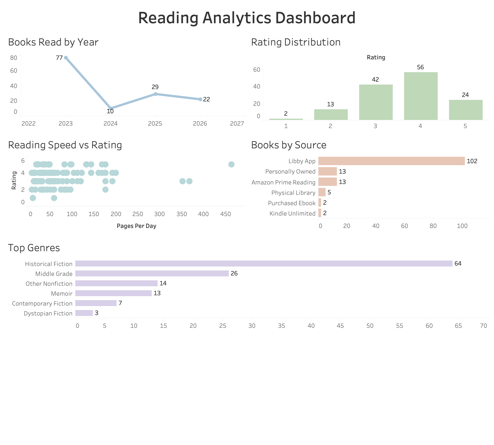

# Book Analytics Platform

A full-stack personal data analytics project designed to transform denormalized reading history data into a normalized relational database, automated ETL pipeline, and business intelligence reporting layer.

The goal of this project was to develop practical experience in SQL, database design, Python automation, and data analytics workflows while building a real-world analytics platform around multi-year reading history data.

## Interactive Dashboard

Final dashboard built in Tableau using SQL reporting views generated from the SQLite analytics database.



---

## Example Build Output

```text
================================================
BUILD SUMMARY
================================================

Books imported:               138
Authors created:             128
Genres created:              17
Moods created:               22

Book-author relationships:   149
Book-genre relationships:    152
Book-mood relationships:     390

Validation checks passed ✓
```

---

## Tech Stack

- Python
- SQLite
- SQL
- Pandas
- Git / GitHub
- Tableau

---

## Project Architecture

```text
CSV Source Data
      ↓
Python ETL Pipeline
      ↓
SQLite Relational Database
      ↓
SQL Transformation Scripts
      ↓
SQL Analytical Queries
      ↓
Tableau Reporting Views
      ↓
Interactive Tableau Dashboard
```

---

## Features

### Automated ETL Pipeline

Python script automatically:

- Builds SQLite database
- Imports CSV data
- Executes SQL transformation pipeline
- Creates normalized tables
- Builds SQL views for reporting
- Performs validation checks

---

### Relational Database Design

Normalized schema includes:

- Books
- Authors
- Genres
- Moods / Vibes
- Series
- Sources
- Formats

Includes:

- Many-to-many junction tables
- Foreign key relationships
- Lookup tables
- Data validation

---

### SQL Analytics Layer

Analytical SQL queries include:

- Reading trends by year
- Rating analysis
- Author rankings
- Genre rankings
- Mood analysis
- Confidence-weighted scoring
- Reading speed and length analysis
- Seasonal reading trends
- Reread analysis

---

### Reporting Layer

SQL views built specifically for Tableau dashboard development.

Includes:

- Yearly reading summary
- Genre summary
- Mood summary
- Author summary
- Source summary
- Monthly reading summary
- Reading behavior summary

---

### Interactive Tableau Dashboard

Built in Tableau to visualize reading behavior patterns and long-term trends.

Dashboard includes:

- Books read by year
- Rating distribution analysis
- Reading speed vs rating correlation
- Books by acquisition source
- Top genre analysis

---

## Running the Project

See:

```text
docs/setup_and_execution.md
```

---

## Future Improvements

- Recommendation engine based on reading history
- Book trend forecasting using predictive modeling
- Advanced behavioral analytics (seasonality, pacing trends, reread behavior)
- Interactive filtering and expanded dashboard functionality
- Migration from SQLite to PostgreSQL

---

## Why I Built This

This project was designed to strengthen skills in:

- SQL database design
- Data modeling
- ETL pipeline automation
- Analytical SQL querying
- Business intelligence workflows
- Dashboard development

while demonstrating end-to-end analytics engineering practices on a real-world dataset.
